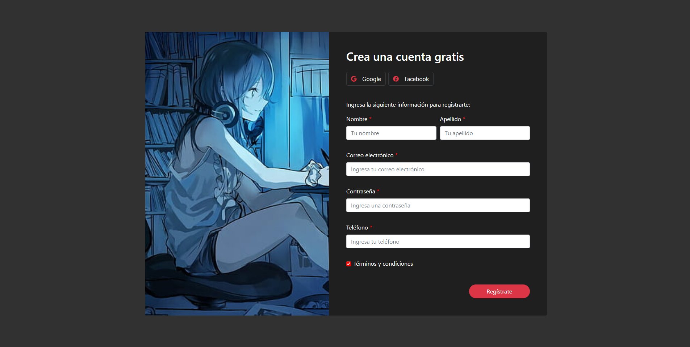

# Validación de formularios

Página web utilizando HTML, CSS, JavaScript y Bootstrap

    

        
    

## GitHub pages

* https://jonathan-yv.github.io/validacion-formulario/

## Características
* Expresiones regulares

## Autor ✒️

* **Jonathan Yair Vazquez Uriostegui**
